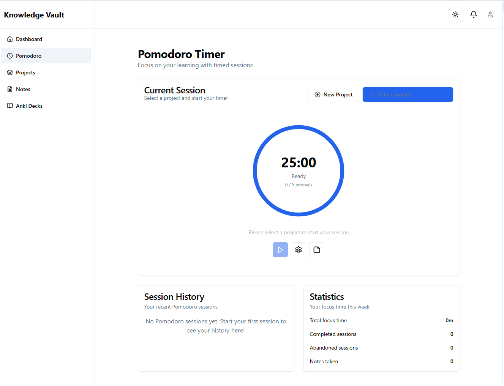
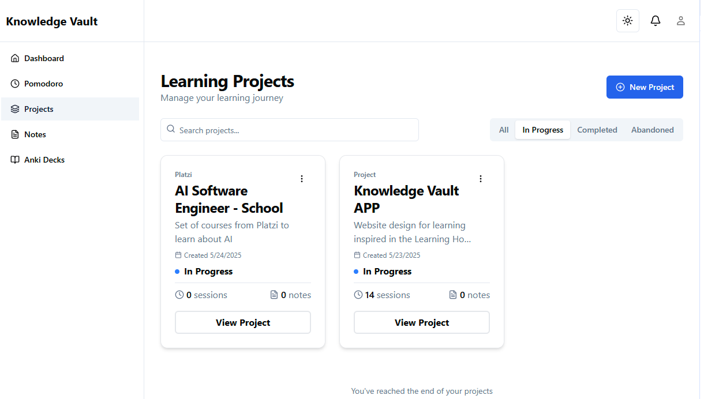
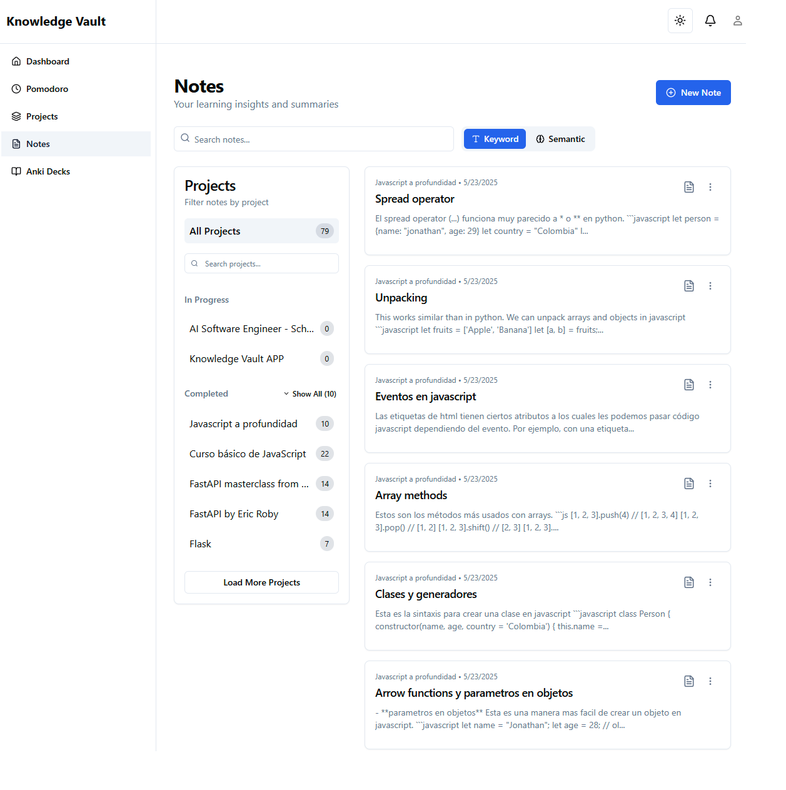

# Knowledge Vault

A modern productivity application that combines Pomodoro time management with intelligent note-taking and project organization. Built to help optimize learning and focus using evidence-based study techniques.

**Inspired by the Coursera course ["Learning How to Learn"](https://www.coursera.org/learn/learning-how-to-learn) by Barbara Oakley**, this application implements practical study methods including spaced repetition, focused learning sessions, and structured note organization to enhance learning effectiveness.

[](https://python.org)
[](https://fastapi.tiangolo.com)
[](https://reactjs.org)
[](https://typescriptlang.org)

## Screenshots

### 🍅 Pomodoro Timer Interface


*Focus sessions with customizable intervals, project selection, and real-time statistics*

### 📚 Project Management Dashboard


*Organize learning materials by category with progress tracking and session history*

### 📝 Intelligent Note-Taking System


*Rich text notes with semantic search, tagging, and project integration*

### 📊 Analytics Dashboard


*Comprehensive analytics with session timelines, productivity insights, and visual progress tracking*

## Table of Contents

- [Features](#features)
- [Tech Stack](#tech-stack)
- [Prerequisites](#prerequisites)
- [Installation](#installation)
- [Usage](#usage)
- [Project Structure](#project-structure)
- [Development Notes](#development-notes)
- [Known Limitations](#known-limitations)
- [Contributing](#contributing)
- [License](#license)
- [Acknowledgments](#acknowledgments)

## Features

### 🍅 **Pomodoro Timer System**
- Customizable work/break intervals based on the Pomodoro Technique
- Session tracking with completion, abandonment, and progress analytics
- Project-linked sessions for focused learning periods
- Cross-tab synchronization and timer persistence
- Weekly statistics and productivity insights

### 📚 **Learning Project Management**
- Organize learning materials by subject/category
- Track project progress and session history
- Filter and search projects by status and category
- Visual progress indicators and time tracking

### 📝 **Intelligent Note-Taking**
- Rich text notes with Markdown support
- **Semantic search** using AI embeddings for natural language queries
- Traditional keyword search alongside semantic search
- Tag-based organization and project linking

### 📊 **Analytics Dashboard**
- Session timeline visualization
- Project activity tracking with charts
- Daily/weekly productivity statistics
- Session completion rates and focus time analysis

### 🔍 **AI-Powered Features**
- Semantic search through notes using OpenAI embeddings
- Vector similarity search for finding related content
- PostgreSQL pgvector integration for efficient vector operations

## Tech Stack

### Backend
- **FastAPI** - Modern, fast web framework for building APIs
- **PostgreSQL** - Primary database with advanced features
- **pgvector** - Vector similarity search for semantic note search
- **SQLModel** - SQL databases in Python, designed for simplicity and compatibility
- **Alembic** - Database migration management
- **OpenAI API** - Embeddings generation for semantic search
- **JWT** - Authentication with refresh token support

### Frontend
- **React 19** - User interface library
- **TypeScript** - Type-safe JavaScript development
- **Vite** - Fast build tool and development server
- **TailwindCSS** - Utility-first CSS framework
- **Radix UI** - Accessible component primitives
- **Zustand** - Lightweight state management
- **React Router** - Client-side routing
- **Recharts** - Data visualization and charting

### Development & Deployment
- **uv** - Fast Python package manager
- **Docker** - Containerization support
- **Alembic** - Database migrations
- **ESLint & Prettier** - Code linting and formatting

## Prerequisites

- **Python 3.10+**
- **Node.js 18+** 
- **PostgreSQL 15+** with pgvector extension
- **OpenAI API Key** (for semantic search features)

## Installation

### 1. Clone the Repository
```bash
git clone https://github.com/yourusername/knowledge_vault.git
cd knowledge_vault
```

### 2. Database Setup
```bash
# Install PostgreSQL and pgvector extension
# On Ubuntu/Debian:
sudo apt-get install postgresql postgresql-contrib
sudo -u postgres psql -c "CREATE EXTENSION vector;"

# Create database
sudo -u postgres createdb knowledge_vault
```

### 3. Backend Setup
```bash
# Install uv (Python package manager)
curl -LsSf https://astral.sh/uv/install.sh | sh

# Install Python dependencies
uv sync

# Copy environment variables
cp .env.example .env
# Edit .env with your database credentials and API keys
```

### 4. Frontend Setup
```bash
cd frontend
npm install
```

### 5. Database Migration
```bash
# Run database migrations
uv run alembic upgrade head
```

### 6. Environment Configuration
Edit `.env` file with your configuration:
```env
# Database
DB_USERNAME=your_db_user
DB_PASSWORD=your_db_password
DB_HOST=localhost
DB_PORT=5432
DB_NAME=knowledge_vault

# Security
SECRET_KEY=your-secret-key-here
ALGORITHM=HS256

# AI Features
OPENAI_API_KEY=your-openai-api-key
```

## Usage

### Start the Backend Server
```bash
uv run uvicorn app.main:app --reload --host 0.0.0.0 --port 8000
```

### Start the Frontend Development Server
```bash
cd frontend
npm run dev
```

### Access the Application
- **Frontend**: http://localhost:5173
- **Backend API**: http://localhost:8000
- **API Documentation**: http://localhost:8000/docs

### First Steps
1. Create an account on the signup page
2. Create your first learning project
3. Start a Pomodoro session linked to your project
4. Take notes during or after your sessions
5. Use the dashboard to track your progress

## Project Structure

```
knowledge_vault/
├── app/                    # FastAPI backend
│   ├── api/               # API endpoints
│   │   ├── core/              # Configuration and utilities
│   │   ├── crud/              # Database operations
│   │   └── schemas/           # Pydantic models
│   ├── frontend/              # React frontend
│   │   ├── src/
│   │   │   ├── components/    # Reusable UI components
│   │   │   ├── features/      # Feature-based modules
│   │   │   ├── services/      # API integration
│   │   │   └── store/         # State management
│   ├── alembic/               # Database migrations
│   └── docs/                  # Additional documentation
```

## Development Notes

### 🎯 **Project Timeline**
This application was developed in approximately **one week** as a learning project, leveraging **Cursor AI** as the primary development tool to accelerate frontend development.

### 👨‍💻 **Developer Background**
Built by a backend/software engineer exploring modern frontend development. This project served as a practical way to learn React, TypeScript, and modern frontend tooling while implementing familiar backend concepts.

### 🛠️ **AI-Assisted Development**
Heavy use of **Cursor AI** enabled rapid prototyping and implementation of complex features that would traditionally require extensive frontend expertise, demonstrating the potential of AI-assisted development workflows.

## Known Limitations

- **Local Development Only**: Currently configured for local development, not production deployment
- **Single User Focus**: Authentication system present but optimized for single-user scenarios
- **API Rate Limits**: OpenAI API usage subject to rate limits and costs
- **Browser Compatibility**: Optimized for modern browsers (Chrome, Firefox, Safari)

## Contributing

This is primarily a personal learning project, but suggestions and improvements are welcome! Please feel free to:

- Open issues for bugs or feature requests
- Submit pull requests for improvements
- Share feedback on the implementation approach

## License

This project is licensed under the MIT License - see the [LICENSE](LICENSE) file for details.

## Acknowledgments

### 📚 **Educational Inspiration**
- **["Learning How to Learn"](https://www.coursera.org/learn/learning-how-to-learn)** by Barbara Oakley - The foundational course that inspired this project's approach to effective learning techniques
- **Pomodoro Technique** by Francesco Cirillo - Time management methodology implemented in the timer system

### 🛠️ **Development Tools**
- **[Cursor AI](https://cursor.sh/)** - AI-powered code editor that accelerated development
- **[FastAPI](https://fastapi.tiangolo.com/)** - Excellent documentation and developer experience
- **[Radix UI](https://www.radix-ui.com/)** - Accessible component primitives
- **[TailwindCSS](https://tailwindcss.com/)** - Utility-first CSS framework

### 💡 **Technical Resources**
- Various open-source projects and documentation that provided implementation guidance
- The developer community for tools, libraries, and best practices

---

**Note**: This is a personal learning project created to explore modern web development while implementing evidence-based study techniques. It showcases the integration of backend and frontend technologies in a practical, real-world application.
